# Architecture — 4th-devs-craft

This document describes how the project is structured, how control and data move through it, and how it talks to external services. Diagrams use [Mermaid](https://mermaid.js.org/); they render in GitHub, many IDEs, and static site generators.

---

## 1. Purpose in one paragraph

The app is a **minimal tool-calling agent**: a user prompt is kept in a **conversation history**, sent to **OpenAI’s Responses API** (`gpt-4o`) together with **JSON Schema–style function definitions**. When the API returns **function calls**, Node **executes** the matching local modules, appends **function outputs** to the history, and **loops** until the API returns a final **assistant message** (or until a **maximum iteration** count). Optional tools call **Google Gemini** (image generation) and **Firecrawl** (search and scrape).

---

## 2. System context

Who talks to whom at the highest level.

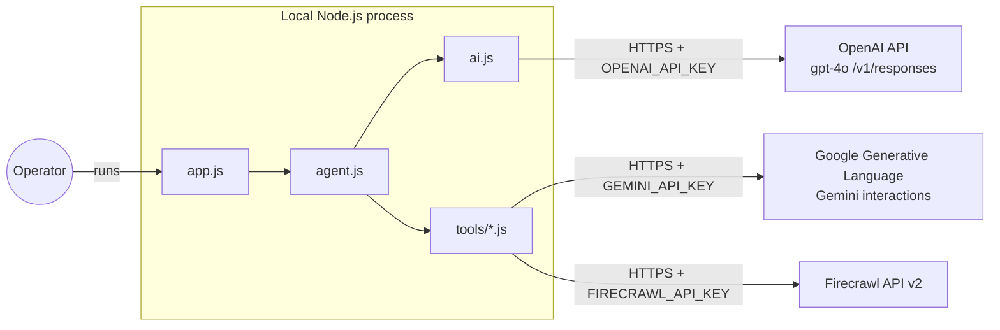

---

## 3. Module map and dependencies

Files and import direction only (no runtime loop shown here).

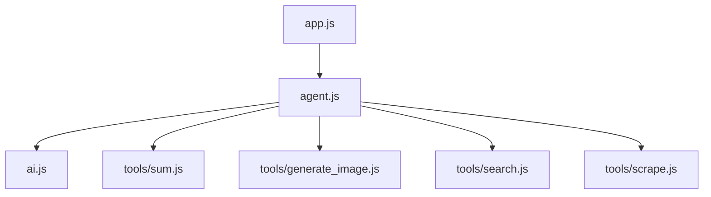

---

## 4. Tool plugin contract

Each tool module is two exports: a **definition** (sent to OpenAI) and an **execute** (run locally).

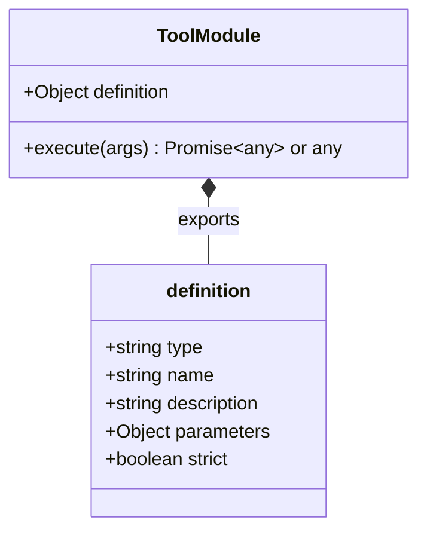

Note: `definition.type` is the literal string `function` in the JSON sent to OpenAI.

`agent.js` builds:

- `definitions` — `tools.map(t => t.definition)` passed into every `chat()` call.
- `execute(calls, history)` — for each OpenAI `function_call`, finds the tool by `name`, `JSON.parse`s `arguments`, calls `tool.execute(args)`, then pushes a history item with `type: "function_call_output"`.

---

## 5. Conversation history shape (conceptual)

The `history` array mixes **user turns** and **raw API output blocks**. Roughly:

| Source | What gets appended |
|--------|---------------------|
| User | `{ role: "user", content: string }` |
| After each `chat()` | Spread of `data.output` from OpenAI (`...answer.output`) |
| After each tool | `{ type: "function_call_output", call_id, output: JSON string }` |

The next request sends the **entire** `history` plus **tool definitions** again (`chat(history, definitions)`).

---

## 6. Main agent loop (activity)

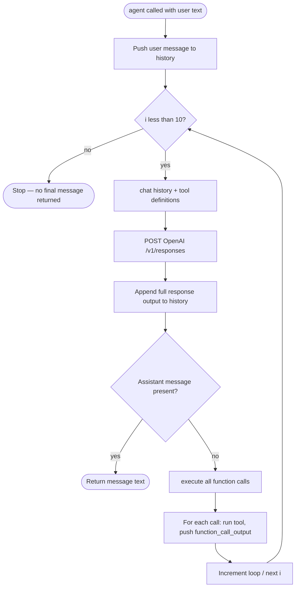

**Exit conditions:**

- **Success:** `answer.message` is set — first `output` item with `type === "message"` has extractable text (`message?.content[0].text`).
- **Implicit stop:** after **10 iterations** without returning, the function falls off the end and returns **`undefined`**.

---

## 7. Sequence — end-to-end (multi-turn tool use)

Typical flow: user asks something that needs search and/or tools, then the model answers in natural language.

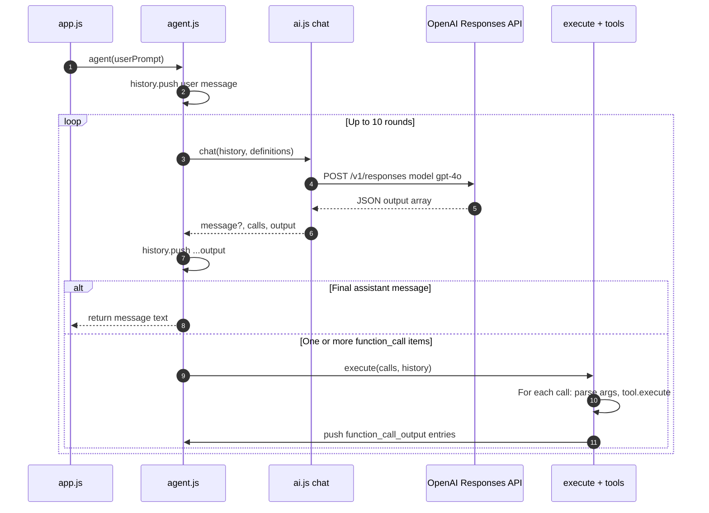

---

## 8. Sequence — `chat()` and OpenAI response handling

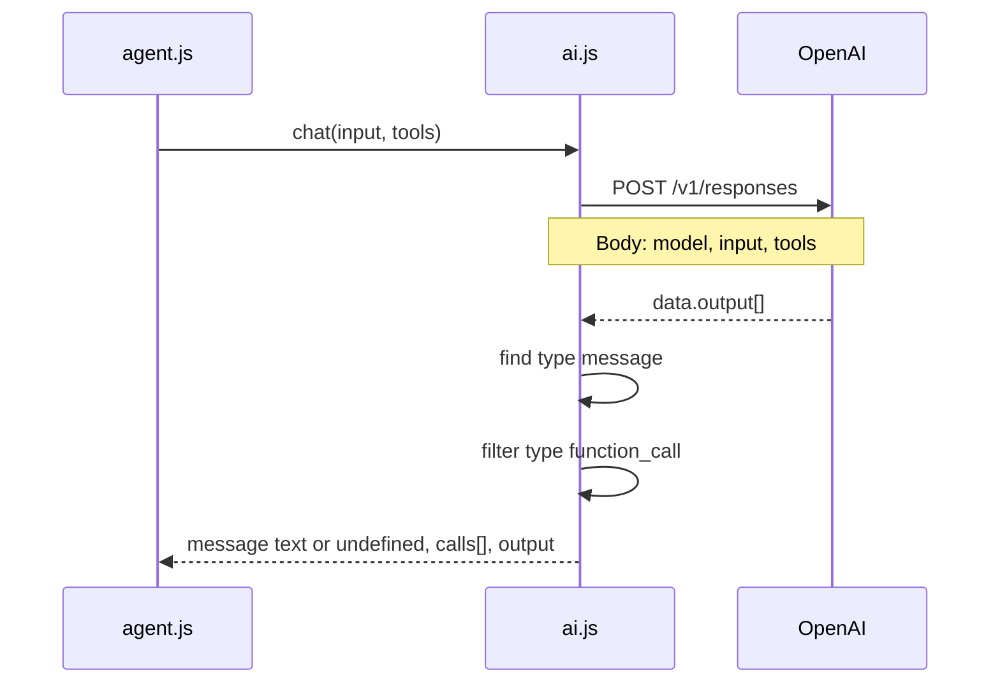

**Coupling note:** `chat()` assumes a final assistant message exposes text at `message.content[0].text`. If the API shape changes or returns multiple content parts, this should be revisited.

---

## 9. Sequence — executing a batch of tool calls

`execute` runs calls **sequentially** in array order.

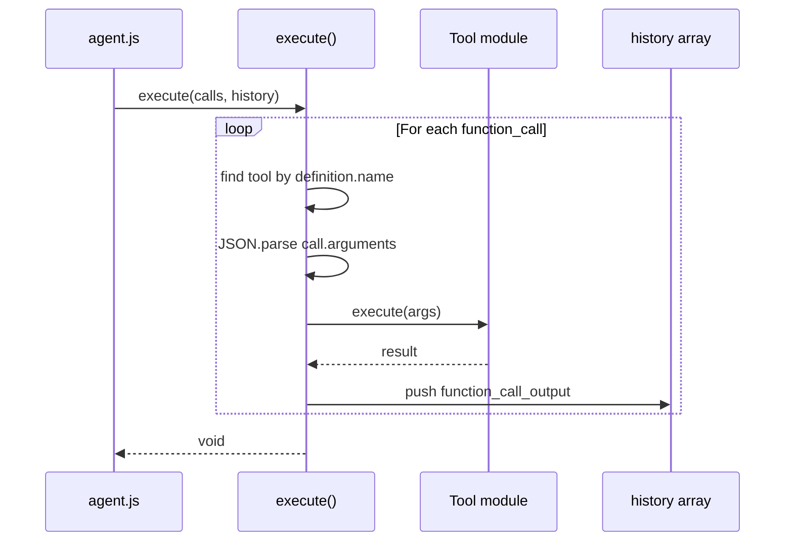

If a tool **throws**, the error propagates and the agent loop **does not** catch it — the process fails fast unless wrapped at a higher level.

---

## 10. Sequence — `sum` (local, no network)

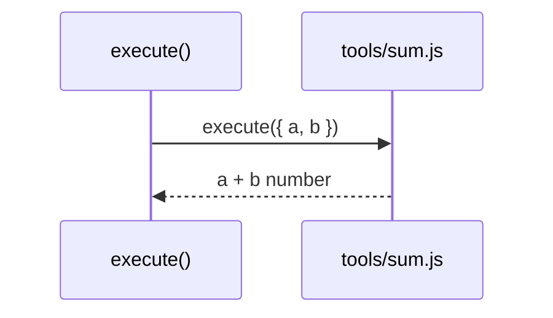

---

## 11. Sequence — `generate_image` (Gemini)

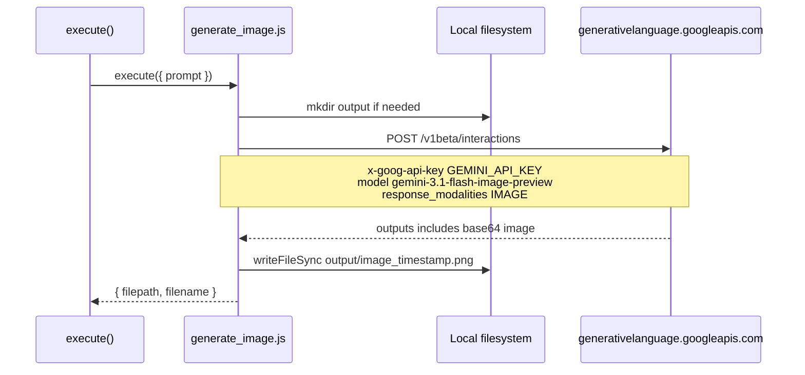

---

## 12. Sequence — `web_search` (Firecrawl)

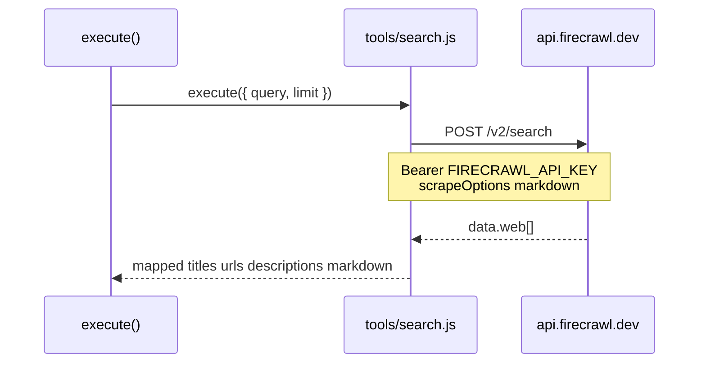

---

## 13. Sequence — `scrape_url` (Firecrawl)

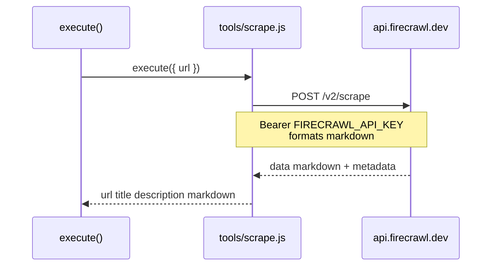

---

## 14. Deployment / runtime view

No container orchestration: a single **Node process**, env vars from `.env` (e.g. `node --env-file=.env app.js` on supported Node versions).

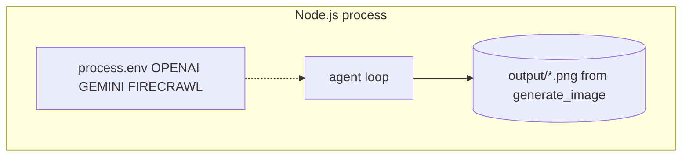

---

## 15. Security and secrets

- **Keys** travel only in **HTTPS** headers (`Authorization` / `x-goog-api-key` / Firecrawl bearer).
- **`.env`** must stay local; it is gitignored in this repo pattern.
- **Tool implementations** should treat arguments as **untrusted** if the app ever exposes `agent()` to end users (currently `app.js` is a trusted local entry).

---

## 16. Implementation caveats (important for evolving the codebase)

1. **Shared `history`:** In `agent.js`, `history` is a **module-level array**. Every `agent()` invocation **appends to the same** list, so concurrent or sequential **independent** conversations are not isolated unless you refactor to per-call history (or reset the array deliberately).

2. **Loop cap:** Ten iterations is a **safety bound**; complex tasks might need a higher cap or adaptive stopping.

3. **No streaming:** `chat()` waits for the full HTTP response; there is no token streaming or partial UI updates.

4. **Tool registration:** New tools require both a new file and an entry in the `tools` array in `agent.js`.

5. **OpenAI response parsing:** Only the **first** message block and **first** text content slice are used for the return value; richer multimodal outputs are not surfaced.

---

## 17. Related documentation

- `README.md` — setup and run instructions.
- `docs/openai.md`, `docs/gemini.md`, `docs/firecrawl.md` — API-oriented notes aligned with this architecture.
